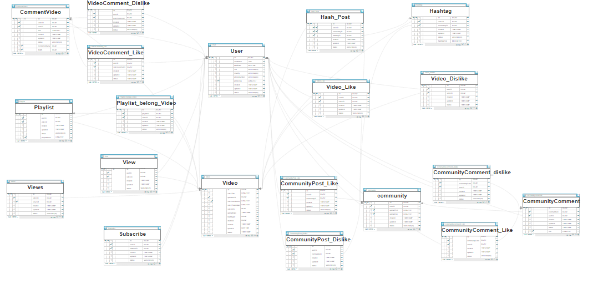
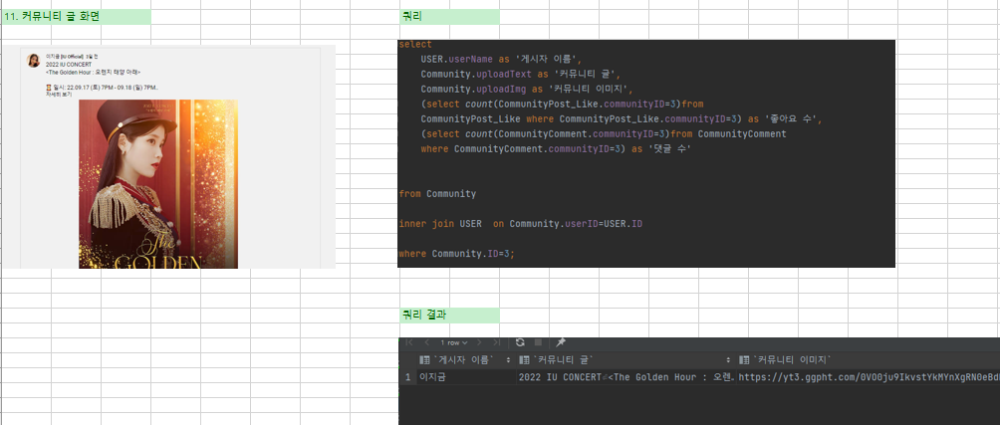
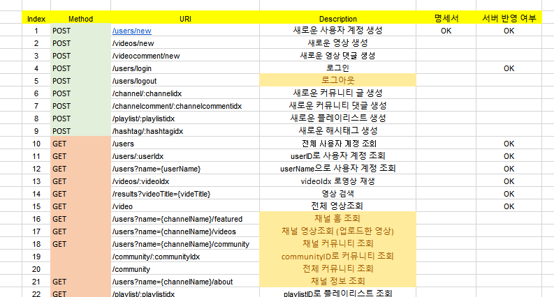
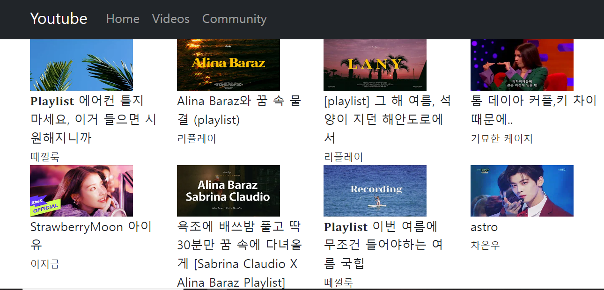

# 2022 SUMMER PROJECT 🥽

### 🌊 Step1. DB ERD설계

대상테이블과 행위테이블을 나누어 설계.
행위에 대한 테이블의 경우 서로 다른 entity간의 관계가 N:M인 경우에만 추가  

작업일지: https://meaningland02.tistory.com/24

### 🌊 Step2. DataGrip으로 쿼리 작성하기

작업일지: https://meaningland02.tistory.com/25

### 🌊 Step3. RestAPI 설계하기 

RestAPI를 리액트 axios와 연결한 모습 ([GET]app/video)

작업일지: